[3-1 Mysterious Name](#3-1-mysterious-name)   
[3-4 Long Parameter List](#3-4-long-parameter-list)   
[6-1 Extract function](#6-1-extract-function)   
[6-2 Inline function](#6-2-inline-function)  
[6-3 Extract Variable](#6-3-extract-variable)    
[6-4 Inline Variable](#6-4-inline-variable)   
[6-5 Change Function Declaration](#6-5-change-function-declaration)   
[6-6 Encapsulate Variable](#6-6-encapsulate-variable)   
[6-7 Rename Variable](#6-7-rename-variable)   
[6-8 Introduce Parameter Object](#6-8-introduce-parameter-object)   
[6-9 Combine Functions into Class](#6-9-combine-functions-into-class)   
[6-10 Combine Functions into Transform](#6-10-combine-functions-into-transform)   
[6-11 Split Phase](#6-11-split-phase)   
[7-1 Encapsulate Record](#7-1-encapsulate-record)  
[7-2 Encapsulate Collection](#7-2-encapsulate-collection)    
[7-3 Replace Primitive with Object](#7-3-replace-primitive-with-object)  
[7-4 Replace Temp with Query](#7-4-replace-temp-with-query)   
[7-5 Extract Class](#7-5-extract-class)   
[7-6 Inline Class](#7-6-inline-class)     
[7-7 Hide Delegate](#7-7-hide-delegate)   
[7-8 Remove Middle Man](#7-8-remove-middle-man)   
[7-9 Substitute Algorithm](#7-9-substitute-algorithm)   
[8-5 Replace Inline Code with Function Call](#8-5-replace-inline-code-with-function-call)    
[8-6 Slide Statements](#8-6-slide-statements)   
[8-7 Split Loop](#8-7-split-loop)   
[8-8 Replace Loop with Pipeline](#8-8-replace-loop-with-pipeline)   
[8-9 Remove Dead Code](#8-9-remove-dead-code)   
[기타](#btz)


# Chapter 3 Bad Smells in Code
## 3. 1 Mysterious Name
 우리의 코드는 평범하고 명확해야 한다.
 clean code의 가장 중요한 부분 중 하나는 좋은 이름으로 함수, 모듈, 변수, 클래스의 이름을 지정하는데 많은 생각을 하여 그들이 하는 일과 사용 방법을 명확하게 전달한다.
  > but our code needs to be mundane and clear. One of the most important parts of clear code is good names, so we put a lot of thought into naming functions, modules, variables, classes, so they clearly communicate what they do and how to use them.
  >> put somehting into something = (시간, 노력 등) ~에 쏟아붓다, 생각하다, 고려하다.

----

## 3-4 Long Parameter List
 * 매개변수 수가 줄어들고, 데이터 사이의 관계가 명확해진다.

😞 Before    
```js
const station = {
  name: "ZB1",
  readings: [
    { temp: 47, time: "2016-11-10 09:10" },
    { temp: 43, time: "2016-11-10 09:20" },
    { temp: 42, time: "2016-11-10 09:30" },
    { temp: 45, time: "2016-11-10 09:40" },
    { temp: 41, time: "2016-11-10 09:50" },
    { temp: 23, time: "2016-11-10 09:60" },
  ],
};
function readingsOutsideRange(station, min, max) {
  return station.readings.filter((r) => r.temp < min || r.temp > max);
}
console.log(readingsOutsideRange(station, 43, 46));
```

😃 After 
```js
class NumberRange {
  constructor(min, max) {
    this._data = { min: min, max: max };
  }

  isCanContain(temperature) {
    return temperature < this.min || temperature > this.max;
  }

  get min() { return this._data.min; }
  get max() { return this._data.max; }
}
const operatinPlan = { min: 43, max: 46 };
const range = new NumberRange(operatinPlan.min, operatinPlan.max);

function readingsOutsideRange(station, range) {
  return station.readings.filter((reading) =>
    range.isCanContain(reading.temperature)
  )}
console.log(readingsOutsideRange(station, range));
```

---
# Chapter 6 A First Set of Refactorings
## 6-1 Extract function
   

😞 Before  
 ```js
 const invoice = {
  customer: "rsua",
  orders: [
    { amount: 12200 },
    { amount: 502 },
    { amount: 600 },
    { amount: 8500 },
  ],
};

function printOwing(invoice) {
  let outstanding = 0; // 미결된,채불값

  console.log("*********************");
  console.log("***** 고객 채무 ******");
  console.log("*********************");

  for (const o of invoice.orders) {
    outstanding += o.amount;
  }

  const today = new Date();

  invoice.dueDate = new Date(
    today.getFullYear(),
    today.getMonth(),
    today.getDate() + 30
  );

  console.log(`고객명 : ${invoice.customer}`);
  console.log(`채무액 : ${outstanding}`);
  console.log(`마감일 : ${invoice.dueDate.toLocaleDateString()}`); // toLocaleDateString() `yyyy.mm.dd` 양식으로 반환
}

printOwing(invoice);
 ```

😃 After 
```js
invoice = {
  customer: "rsua",
  orders: [
    { amount: 12200 },
    { amount: 502 },
    { amount: 600 },
    { amount: 8500 },
  ],
};

function printOwing(invoice) {
  printBanner();
  function printBanner() {
    console.log("*********************");
    console.log("***** 고객 채무 ******");
    console.log("*********************");
  }

  let outstanding = calculateOutstanding(invoice);

  recordDueDate(invoice);

  function recordDueDate(invoice) {
    const today = new Date();
    invoice.dueDate = new Date(
      today.getFullYear(),
      today.getMonth(),
      today.getDate() + 30
    );
  }

  printDetail(invoice, outstanding);

  function printDetail(invoice, outstanding) {
    console.log(`고객명 : ${invoice.customer}`);
    console.log(`채무액 : ${outstanding}`);
    console.log(`마감일 : ${invoice.dueDate.toLocaleDateString()}`); // toLocaleDateString() `yyyy.mm.dd` 양식으로 반환
  }

  function calculateOutstanding(invoice) {
    let result = 0;
    for (const o of invoice.orders) {
      result += o.amount;
    }
    return result;
  }
}
printOwing(invoice);

```

 During my career, I've heard many arguments about when to enclose code in its own function.
1. Some of these guidelines were based on length: Functions should be no larger than fit on a screen (모니터의 한줄이 넘어갈 경우)
2. Some were based on reuse: Any code used more than once should be put in its own function, but code only used once should be left inline

**The argument that makes most sense to me, however, is the separation(분리) between intention(목적, 의도) and implementation(구현).**
코드를 보고 무엇을 하는지 파악하는데 노력을 기울여야 하는 경우 이를 함수로 추출하고, 함수가 무슨일을 하는지 알맞는 이름을 지정해야 한다. 
그리고 다시 읽었을 때 함수의 목적이 바로 눈에 띄어야 한다.

일부 사람들은 함수 호출이 성능 비용을 걱정하는데, 과거에는 그런 요인이 있었으나 지금은 매우 드물다, 최적화 컴파일러는 더 쉽게 캐시할 수 있는 더 짧은 함수에서 더 잘 작동하는 경우가 많다. 
성능 최적화에 대한 것은 일반지침을 준수해라

 * Create a new function, and name it after **the intent of the function**(name it by WHAT IT DOES, not by how it does it)어떻게 하느냐가 아니라 무엇을 하느냐에 따라 이름을 짓다


----
## 6-2 Inline function

  가독성을 위해 변수, 함수의 이름을 명확하게 작성하는 것 뿐만아니라, 코드 본문도 이름만큼 명확해야 한다.
  특히 본문에서 참조가 많이 되는 경우 불필요한 참조를 최소하 하는 것이 좋다.  

---
## 6-3 Extract Variable
  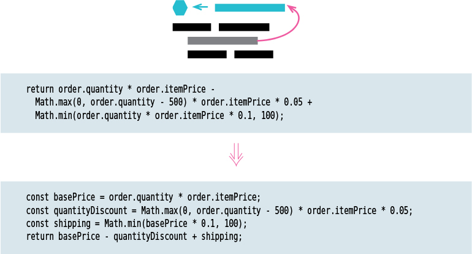
    * 일부 표현식은 매우 복잡하고 읽기 어려움. 이를 지역변수로 관리
    * 함수 내애서만 의미가 있다면 변수 추출할 것

----
## 6-4 Inline Variable
  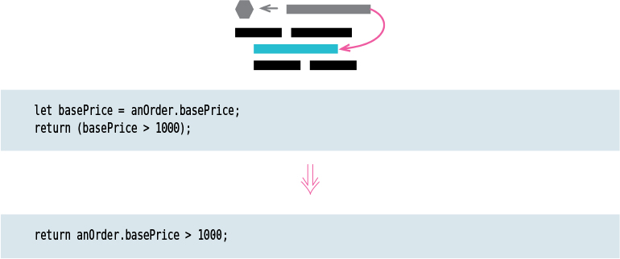

---
## 6-5 Change Function Declaration
----
## 6-6 Encapsulate Variable
* 문제는 다른 타입을 설정할 때 문제: JS는 원시타입이외에 모든 타입을 받기 때문에
* 캡슐화를 통해서 객체의 속성명으로 설정할 수 있는 유효한 범위를 설정해야 한다.
* 변수와 메서드를를 캡슐화하여 액세스할 수 잇는 위치를 제한하고 구조를 명시적으로 만든다.
* 더 많은 위치에서 데이터에 액세스할 수 있는 경우 속성을 유지 관리하기가 더 어려워진다.

  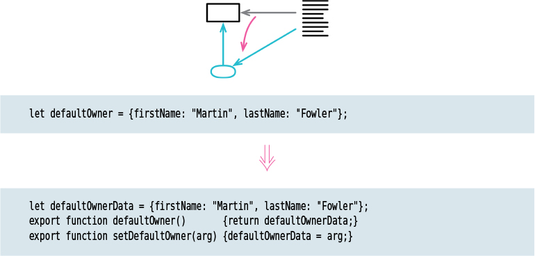


데이터를 조작하는 일은 함수와 달리 곤란하다.
데이터를 변수로 만들어서 조작하지 말고 함수를 만들어서 호출하자
1. 데이터를 접근하고 수정하는 함수 생성
2. 데이터와 함수의 스코프 체크
3. 변수 접근 범위 제한
위와 같은 방법으로 하면 데이터를 통째로 변경할 때 쓸 수 있다.
그런데 데이터를 부분적으로 변경하며 조작해야 할 때는 어떻게 해야 할까


[참고 site](https://www.educba.com/encapsulation-in-javascript/)


```js
var employee = function () {
  var name = "Yun";
  var exp = new RegExp(/\d+/);
  return {
    setName: function (value) {
      if (exp.test(value)) {
        console.log("invalid type ");
      } else {
        name = value;
      }
    },
    getName: function () {
      return name;
    },
  };
}();

console.log(employee.getName());
employee.setName("Kim");
console.log(employee.getName());
employee.setName(42);
employee.name = 42;
console.log(employee.getName());
```
----
## 6-7 Rename Variable
  > underscore(_): 필드 앞에 underscore을 붙여서 외부에서 접근할 수 없는 숨겨진 필드임을 나타내는 방식(컨벤션)
  > We’ve prepended an underscore to indicate functions and variables that shouldn’t be accessed directly
  > 이 규칙으로 인해 개발자는 변경사항이 간주되지 않거나 테스트가 필요하지 않다고 잘못 생각하게 될 수 있다.

 #### ❗ Renaming a Constant
   만약 상수를 리네이밍한다면 캡슐화를 피할 수 있고 일반적으로 복사해서 리네임할 수 있다.
   최초 선언은 아래와 같이
   > const cpyNm = "Acme Gooseberries"
   카피함으로써 리네임을 시작할 수 있다.
   const compnayName = "Acme Gooseberries";
   const cpyNm = companyName;
   사본을 사용하여 차례로 예전이름에서 새로운 이름으로 참조를 변경할 수 있다.

----

## 6-8 Introduce Parameter Object
```js
class CheckUserid {
  constructor(min, max) { this.data = { min: min, max: max }; }

  compareId(userid) { return userid >= this.min && userid <= this.max; }

  get min() { return this.data.min; }
  get max() { return this.data.max; }
}

const rangeUserId = { min: 5, max: 10 };
const range = new CheckUserid(rangeUserId.min, rangeUserId.max);

const checkLength = (userid, range) => {
  const getUserIdFormInputFiled = userid.value.length;
  const isRanged = range.compareId(getUserIdFormInputFiled);
  isRanged 
  ? console.log("Result : Your ID is valid") 
  : console.log("Result : Your ID is invalid");

  // console.log(`getUserIdFormInputFiled: ${getUserIdFormInputFiled}`);
  // console.log(`isRanged: ${isRanged}`);
};

form.addEventListener("submit", (e) => {
  e.preventDefault();
  checkLength(userid, range);
});


```
----
## 6-9 Combine Functions into Class
 * 함수 무리를 발견하면 하나의 클랙스로 묶는다. 이는 함수들이 공유하는 환경을 더 명확하게 표현
 * 공통 엔티티(data)에서 작동하는 작업 그룹을 사용할 때 클래스를 사용하면 메서드가 공유할 공통 환경이 더 명확해진다.
 * 각 함수에 전달되는 인수가 줄어서 함수 호출을 간결하게 만들 수 있다.
----
## 6-10 Combine Functions into Transform
----
## 6-11 Split Phase
----
# Chapter 7 Encapsulation

## 7-1 Encapsulate Record
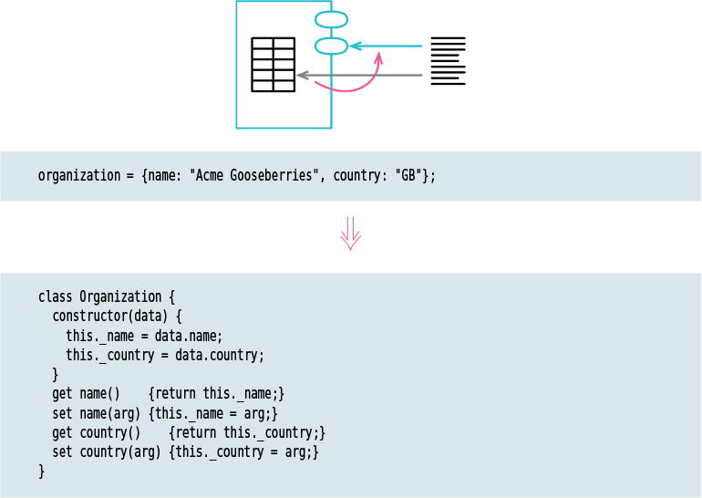

 "가변데이터를 저장하는 용도로 레코드보다 객체를 선호" 레코드는 어떤 형태의 데이터 구조인가..?
  - 레코드: 데이타 단위, 기본적인 자료구조
  - 다양한 데이터를 구조화시켜 생각하는 것이 편하기 때문에 `구조화된 데이터` = `레코드`가 필요하다. ( 비슷한 유형으로 객체, 구조체(C언어에서의 기본 타입만을 가지고 나타낼 수 없는 복잡한 데이터를 표현))
  
 절차: 
1. 레코드를 담은 변수를 캡슐화 (6.6)
    함수는 데이터보다 다루기기 수다월하다. 함수의 사용은 대체로 호출한 다는 뜻이고 함수의 이름을 바구거나 른 모듈로 옮기기는 어렵지 않다. 여차하면 기존 함수를 그대로 두고 전달(passing)함수로 활용할 수도 있기 때문.

    반대로 데이터는 함수보다 다루기가 까다로운데, 함수처럼 처리할 수도 없고, 데이터는
    **참조하는 모든 부분**을 한 번에 바꿔야 코드가 작동하기 때문
    즉 유효범위가 넓어질수록 다루기 어려운다. 전역데이터가 골칫거리인 이유임
    접근할 수 있는 범위가 넓은 데이터를 옮길 때는 먼저 데이터로의 접근을 독접하는 함수를 만드는 식으로 캡슐화하는 것이 가장 좋은 방법
    
2. 레코드를 감싼 단순한 클래스로 해당 변수로 내용을 교체, 원본 레코드를 반환하는 접근자 정의(getter)
3. 테스트
4. 원본 레코드 대신 새로 정의한 클래스 타입의 객체를 반환하는 함수 만든다
5. 원본 레코드 반환하는 예전 함수를 사용하는 코드를 4.에서 만든 새 함수로 사용하도록 바꾼다.
    필드에 접근할 때는 객체 접근자를 사용,
6.  클래스에서 원본 데이터를 반환하는 접근자와 (1.에서 검색하기 쉬운 이름을 불여둔) 원본 레코드를 반환하는 함수들을 제거한다.
7.  테스트 한다
8.  레코드의 필드도 데이티 구조인 중첨 구조라면 레코도 캡슐화하기와 컬헥션 캡슐화하기 7.2를 재귀적으로 적용한다.

> For instance 
```js
// const organization = { name: "Acme Gooseberries", country: "GB" };

result += `<h1>${getOrganization().name}</h1>`;
getOrganization().name = newName;

function getOrganization() { return organization; }

class Organization {
  constructor(data) {
    this._name = data.name;
    this._country = data.country;
  }

  get name() { return this._name; }
  set name(aString) { this._name = aString; }
  get country() { return this._country; }
  set country(aCountryCode) { this._country = aCountryCode; }
}
const organization = new Organization({ name: "Acme Gooseberries", country: "GB", });
```

> For Instance
```js
// Before
const market = { product: "banana", price: "5000", amount: "5" };

console.log(`상품 : ${market.product}`);
console.log(`가격 : ${market.price}`);
console.log(`개수 : ${market.amount}`);
console.log(`지불금액 : ${market.price * market.amount}`);
```
```js
// After
class Cart {
  constructor(data) {
    this._product = data.product;
    this._price = data.price;
    this._amount = data.amount;
  }
  get product() { return this._product; }
  get price() { return this._price; }
  get amount() { return this._amount; }
  get totalPrice() { return this._price * this._amount; }
}

const myCart = new Cart({ product: "banana", price: 1500, amount: 5 });

itemPrint();

const itemPrint = () => {
console.log(`상품: ${myCart.product}`);
console.log(`가격: ${myCart.price}`);
console.log(`개수: ${myCart.amount}`);
console.log(`지불금액: ${myCart.totalPrice}`);
}
```
---

## 7-2 Encapsulate Collection
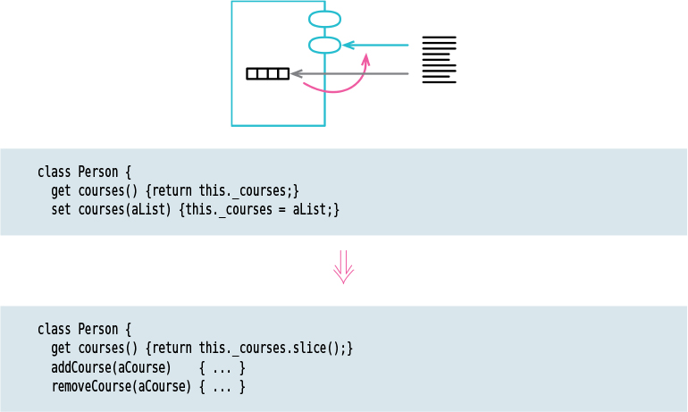

---

## 7-3 Replace Primitive with Object
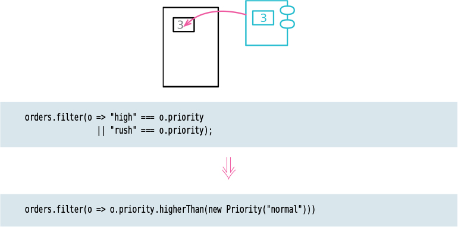

---

## 7-4 Replace Temp with Query
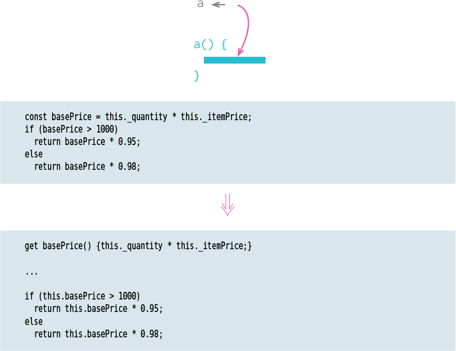

---

## 7-5 Extract Class
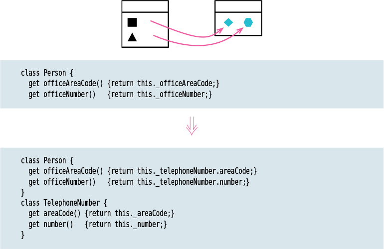
 * 하나의 클래스가 다양한 일을 할때, 프로그램이 확장되면서 method, filed 추가되고, 결국 일부 class 상상했던 것보다 많은 책임을 수행한다.
 * 이 리팩토링은 객체지향 5원칙(SOLID) 단일책임원칙 (Single Responsibiltiy Principle)을 준수하는데 도움이 된다. 코드가 더 명확해지고 이해하기 쉬워진다.
    > 단일책임원칙 ; 하나의 객체는 반드시 하나의 동작만의 책임을 갖는다. 


😞 Before 
```js
class Order {
  constructor(product, price) {
    this.product = product;
    this.price = price;
  }
  printOrderDetail(payment) { 
    return `${payment}, ${this.price}`; 
    }
}
```
----
😃 After 
```js
class Order {
  constructor(product, price) {
    this.product = product;
    this.price = new Price(price);
  }}

class Price {
  constructor(price) { this.price = price; }
  printOrderDetail(payment) { 
    return `${payment}, ${this.price}`; 
    }}

```
각 동작이(기능) 하나의 책임으로 본다면 이 객체가 책임은 n가지나 된다. 이렇게 하나의 객체에 너무 많은 책임이 몰려있을 경우 의존성이 높아지게 된다. 서로 의존할 경우 코드수정에 따른 영향이 높아지고 범위 또한 넓어진다.
위 상황에서 해당 원칙은 1객체 = 1책임으로 최대한 명확하고 간결하게 작성


---
## 7-6 Inline Class 
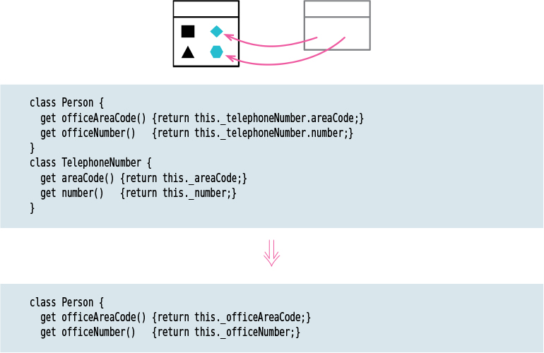

---
## 7-7 Hide Delegate 
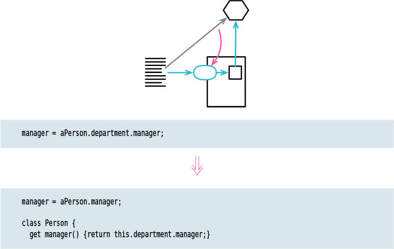

---
## 7-8 Remove Middle Man 
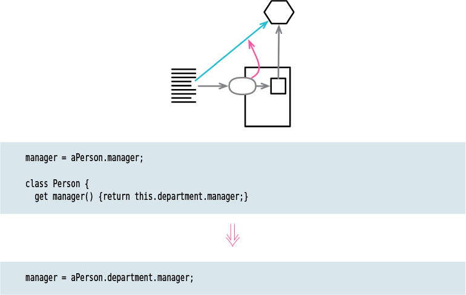

---
## 7-9 Substitute Algorithm 


---
## 8-1 Move Function
## 8-2 Move Field
## 8-3 Move Statements into Function
## 8-4 Move Statements to Callers

## 8-5 Replace Inline Code with Function Call

 * if/else와 같이 `배열에 특정 문자열이 포함여부를 확인`할 경우 `includes` 내장함수를 이용하는게 좋다.
  > `indexOf()` 메서드는 배열에서 지정된 요소를 찾을 수 있는 첫번째 인덱스를 반환하고(중복인경우) 존재하지 않으면 -1을 반환. 만약에 indexOf을 이용하여 return 값이 true/false 인경우 문제는 index가 `0`이 될 수 있으며 `false`로 평가된다. 즉 존재는 `true`이지만 검사간에 `false`로 평가된다.

>For Example
  ```js
  const arr = ['hello'];

  function findNum(arr) {
    if (arr.indexOf('hello')) {
      return true
    }
    return false;
  }  // false
  ```
  `0`의 위치가 거짓이기 때문에 index 숫자와 비교해서 그것이 `ture`인지 테스트해야 한다.
  ```js
  const arr = ['hello'];

  function findNum(arr) {
    return arr.indexOf('hello') > -1
  } // true
  ```
  ```js
  const arr = ['hello','world'];
  function findNum(arr) {
    return arr.includes('hello')
  }
  ```

 * 라이브러리가 제공하는 함수로 대체할 수 있다면 훨씬 좋다. 
    > 배열을 다루는 filter, foreach, map, find
---

## 8-6 Slide Statements
 * 어떤 사람들은 함수의 맨 위에 모든 변수를 선언하는 것을 좋아한다. 하지만, 변수를 처음 사용하기 전에 직전에 선언하는 것을 선호한다.(예제 9-10 라인)
 * `Extract function` 하기전에 준비 단계으로 한다.<br>
 * 선언하기전에 변수의 이동할 수 없으며, 변수를 사용한 후에는 선언을 이동할 수 없다.
 * 해당 코드 줄에 다른 줄에서 수정된 변수가 포함되어 있으면 해당 줄을 수정하는 줄 위로 이동할 수 없다.


##### Example
😞 Before 
```js
const pricingPlan = retrievePricingPlan();
const order = retreiveOrder();
const baseCharge = pricingPlan.base;
let charge;
const chargePerUnit = pricingPlan.unit;
const units = order.units;
let discount;
charge = baseCharge + units * chargePerUnit;
let discountableUnits = Math.max(units - pricingPlan.discountThreshold, 0);
discount = discountableUnits * pricingPlan.discountFactor;
if (order.isRepeat) discount += 20;
charge = charge - discount;
chargeOrder(charge);


```
😃 After 
```js
/*1*/ const pricingPlan = retrievePricingPlan();
/*2*/ const baseCharge = pricingPlan.base;
/*4*/ const chargePerUnit = pricingPlan.unit;

/*5*/ const order = retreiveOrder();
/*6*/ const units = order.units;

/*3*/ let charge;
/*7*/ charge = baseCharge + units * chargePerUnit;

/*8*/ let discountableUnits = Math.max(units - pricingPlan.discountThreshold,0);

/*9*/ let discount;
/*10*/ discount = discountableUnits * pricingPlan.discountFactor;

/*11*/ if (order.isRepeat) discount += 20;
/*12*/ charge = charge - discount;
/*13*/ chargeOrder(charge);

```
> 11번(if(order.isRepeat..)) 코드는 12번째(charge = charge..) 코드 때문에 제한된다.
>  <br>11번 줄에서 상태를 수정한 변수 discount를 12번(charge = charge..) 코드에서 참조하기 때문이다.<br>
> 비슷하게 13번 코드(chargeOrder(charge))도 12번 코드 앞으로 이동할 수 없다.<br>
> 13번 코드가 참조하는 변수가 12번 줄에서 수정하기 때문

* Conclusion
  > 코드 줄을 이리저리 옮기면서 무슨일이 일어나는지, 무엇을 놓혔는지, 세부사항의 흐름들을 찾는데 도움이 된다.
  > 지루한 작업처럼 보일 수 있지만, 이를 간과해서는 안된다. 모든 세부 정보를 선언/추적할 필요 없이 코드에 집중할 수 있다.
  > 리팩토링할 많은 코드를 직면하면 Slide Statements을 시작해라. 새로운 통찰력을 얻는데 도움이 된다.


----
> 출처: 
[The Most undervalued Refactoring: Slide Statements](https://improveandrepeat.com/2019/09/the-most-undervalued-refactoring-slide-statements/)


<!-- 주현님: 명령-질의 분리 원칙 : 함수는 그 성격에 따라 2가지 분류
동작을 수행하는 명령, 답을 구하는 쿼리로 구분 
함수내에서는 상태를 변경하는 코드는 불필요하다 예를들어 .toLowerCase()등을 함수내에 적용하는 행위 등 (데이터 상태를 바꾸는 일) -->

## 8-7 Split Loop
---
## 8-8 Replace Loop with Pipeline
---
## 8-9 Remove Dead Code
---


# Chapter 9 Organizing Data
## 9-1 Split Variable
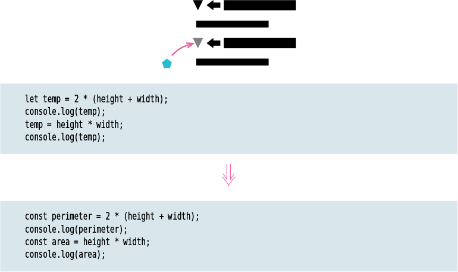
긴 코드의 결과를 저장하기 했다가 가독성 또는 쉽게 참조하려는 목적으로 흔히들 변수에 값을 저장한다.    
단 이러한 변수에는 한 번만 대입해야 한다. 만약 2번 이상 이뤄진다면 여러가지 역할을 한다는 의미   `역할을 둘 이상인 변수가 있다면 split 해야 한다.` No buts about it   
하나의 변수 === 하나의 역할

> For example    

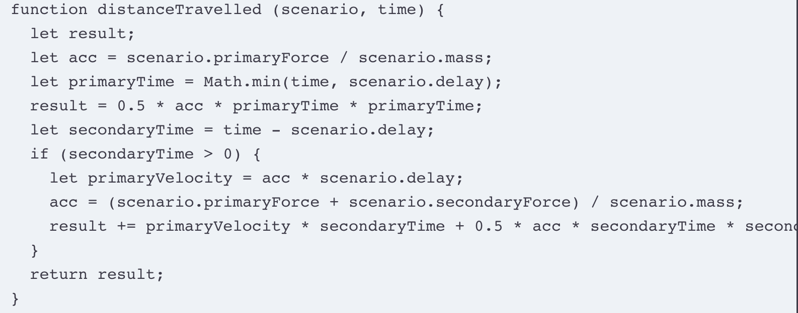

위 예시 함수에서 변수 `acc` 변수에 값이 두 번 대입된다는 점(=역할이 2개라는 의미)   
> 적용 방법
 * 첫 단계로 새로운 이름으로 변수를 선언. (acc -> primaryAcceleration )
 * `const` 불변으로 선언 ( let acc -> const primaryAcceleration)
 * 모든 참조된 변수를 새로운 이름으로 변경 
 * 두 번째로 대입하는 변수를 새로 선언 (acc -> const secondaryprimaryvelocity)
 > 적용된 코드

```js
전) let acc = scenario.primaryForce / scenario.mass;
후) const primaryAcceleration = scenario.primaryForce / scenario.mass;

전) result = 0.5 * acc * primaryTime * primaryTime;
후) result = 0.5 * primaryAcceleration * primaryTime * primaryTime;

전) let primaryVelocity = acc * scenario.delay; 
후) let primaryVelocity = primaryAcceleration * scenario.delay;
 
전) acc = (scenario.primaryForce + scenario.secondaryForce) / scenario.mass;
후) const secondaryAcceleration = (scenario.primaryForce + scenario.secondaryForce) / scenario.mass;
```
---

## 9-2 Rename Filed
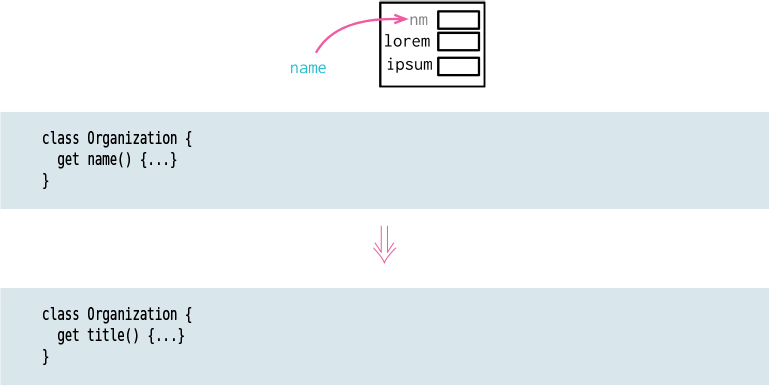

---

## 9-3 Replace Derived Variable with Query
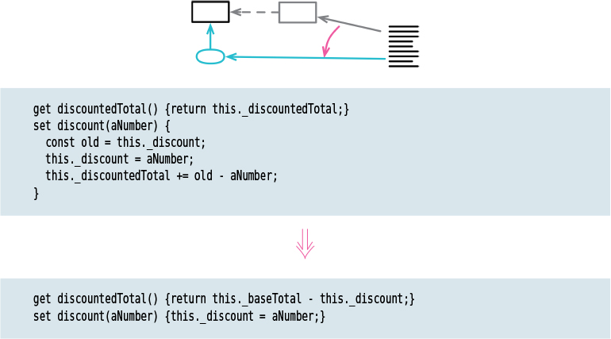

---

## 9-4 Change Reference to Value
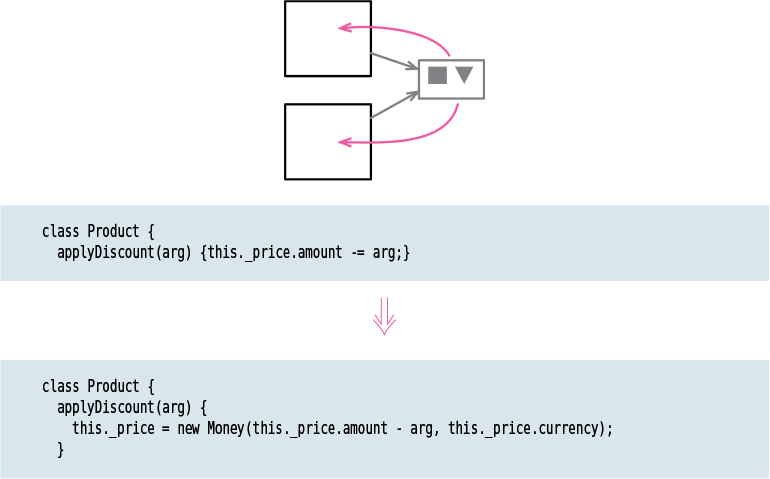

---


## 9-5 Change Value to Reference
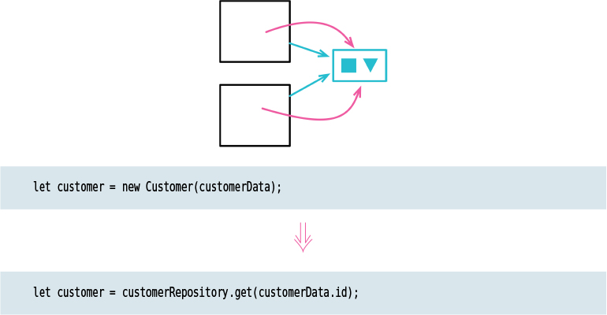

---

# btz

### 시퀀스
‘일련의 연속적인 사건들’ 또는 ‘사건이나 행동 등의 순서’라는 영어 단어 뜻과
코딩에서의마찬가지로,코딩에서의 시퀀스 역시 알고리즘 내에서 공간적·시간적으로 정해져 있는 순서를 뜻하고 있어요. 예를 들어, 주전자에 물을 끓인다고 생각해볼까요? 가장 먼저, 주전자에 물을 가득 채워 넣어요. 그리고나서 가스레인지에 불을 켠 후 물이 끓을 때까지 기다려야겠죠. 이러한 알고리즘 내에서 주전자에 물을 붓는 순서 없이는 주전자 안의 물이 끓지는 않겠죠? 이렇게 꼭 앞뒤가 지켜져야 하는 시·공간적 순서가 바로 '시퀀스'랍니다!
이처럼 알고리즘의 세세한 부분을 완성하는 것이 바로 시퀀스라는 개념인 것이죠.


### statements: 
> 프로그램 언어에서 사칙 연산이나 지수의 연산 실행을 지정하는 프로그램의 단위가 되는 문장
> 프로그래밍에서는 실행가능한(executable) 최소의 독립적인 코드 조각을 일컫는다
> 문법적으로 해당 언어에 적합한 모든 코드 한 줄이나 블록은 statement라고 할 수 있다. statement는 흔히 한 개 이상의 expression과 프로그래밍 키워드를 포함하는 경우가 많다.

Statement와 Expression의 관계
>  expression은 statement의 부분집합이다.


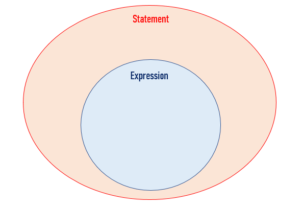
>개념적으로 생각하면 쉽다. ‘3+2’는 평가가 가능한 expression이지만 동시에 실행가능한 구문이기도 하다. 파이썬 인터프리터에 ‘3 + 2’를 입력하면 정상적으로 실행한다. 즉, 모든 expression은 statement다.

반면에 어떤 statement는 expression이지 않다. return 3 이런 구문은 ‘함수에서 3을 반환한다’는 의미일 뿐이지 평가해서 3이라는 값이 나오지 않는다. ‘a = 3’ 같은 표현도 마찬가지이다. ‘3’을 a 라는 변수에 할당할 뿐, 평가 후 어떤 값으로 환원되지 않는다. 이 관계를 집합으로 표현하면 위와 같이 표현할 수 있다.

TDZ, Block Level Scope
일반함수로 작성할 경우 함수를 먼저 호출하고 함수정의를 아래부분에 작성해도 호이스팅되어 정상작동하지만
화살표 함수로 작성한 경우 ReferenceError 발생한다.


-----


> `C99` 표준 이전에는 블록의 시작부분에 변수를 선언해야 했다: C언와 같이 절차식 프로그래밍(저급언어)

### Code Readability
The recommended practice is to put the declaration as close as possible to the first place where the variable is used. This also minimizes the scope. 
From Steve McConnell's "Code Complete" book:
 > Ideally, declare and define each variable close to where it’s first used. A declaration establishes a variable’s type. A definition assigns the variable a specific value. In languages that support it, such as C++ and Java, variables should be declared and defined close to where they are first used. Ideally, each variable should be defined at the same time it’s declared.

### 변수에 대한 참조 지역화  ( Localize References to variables ).

참조가 가깝게 유지하면 코드를 읽는 사람이 한번에 한 섹션에 집중할 수 있다. 
참조가 멀리 떨어져 있으면 Reader에게 프로그램에서 이동하도록 강제한다.
따라서 변수에 대한 참조를 함께 유지하는 주요 이점은 가독성이 향상된다는 것.

"Window of vulnerability" 윈도우 취약점
실수로 변수를 변경하여 새 코드가 추가 될 수 있다.
코드를 읽는 사람은 변수에 포함되어야 하는 값을 잊어버릴 수 잇다.
변수에 대한 참조를 서로 가깝게 유지하여 지역화하는 것이 항상 좋은 생각이다.

### Keep Variables "LIVE" for as short a time as possible
A variable's life begins at the first statement in which it's referenced
and its life ends at the last statements inwhich it's referenced.

변수가 활성 상태인 명령문의 총 수.
예를 들어 변수가 1행에서 처음 참조되고 25행에서 마지막으로 참조된 경우 25개의 명령문의 라이브 시간이 있다.
명령문의 수는 23개가 된다.
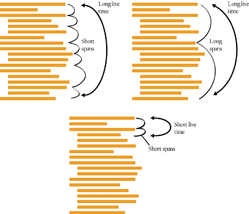
as with span, the goal is to keep the number of low, to keep a variable live for as short a time as possible.

if the variable is assigned a value in line 44 and used in line 45, no other uses of the variable are implied, and you can concentrate on a smaller section of code
when you are thinking about that varaible.

라이브 시간은 큰 루틴을 더 작은 루틴으로 분할할 때 유용하다. 
변수에 대한 참조가 가깝게 유지되면, 리팩토링하는것이 더 쉬워진다.

> 개발자가 어떠한 철학점 관점을 갖느냐에 따라 달라진다.
편의성과 유지보수?능력? 차이는 프로그램을 작성하는 것과 읽는 것의 강조점의 차이로 결정된다.
범위를 최대화 하면 프로그램을 쉽게 작성할 수 있지만, 전역범위가 액세스하기 쉽고,
 매개변수, 클래스의 범위 지정 규칙등을 하지 않아도 되기 때문에.
 반면에, 편의성에 기준을 코드는 하나의 루틴만 이해할 수 없다. 글로벌 데이터를 공유하는 모든 다른 루틴을 이해햐야만 한다. 이러한 프로그램은 읽기 어렵고, 디버그, 수정이 어렵다.

------

## Private Javascript
 * 객체를 캡슐화하는 방법 -> 정보은닉
  
  ### 1. Underscore(_)
  필드 앞에 underscore붙여서 외부에서 접근할 수 없는 숨겨진 필드임을 나타내는 방식(컨벤션)

 ```js
 const obj = {
  	_private: 'foo',
    	get public() { 
        return this._private; 
        },
    }
obj._private // 'foo'
obj.public   // 'foo'
```

JS는 모든 객체는 외부에서 접근이 허용되기 때문에 위의 예시처럼 실제로는 은닉되지 않는다.
널리 알려진 컨벤션이라 앞에 underscore이 붙은 변수나 프로퍼티를 볼 수 있다.
[Airbnb Style-Guide](https://airbnb.io/javascript/#naming--leading-underscore)
이 규칙으로 인해 개발자는 변경사항이 간주되지 않거나 테스트가 필요하지 않다고 잘못 생각하게 될 수 있다.
```js
// bad
this.__firstName__ = 'Panda';
this.firstName_ = 'Panda';
this._firstName = 'Panda';

// good
this.firstName = 'Panda';

// good, in environments where WeakMaps are available
// see https://kangax.github.io/compat-table/es6/#test-WeakMap

const firstNames = new WeakMap();
firstNames.set(this, 'Panda');
```
----
 ### 2. Closure
 ```js
function ObjFactory() {
 const private = 'foo';
  return { 
  	get public() {
     	return private;
   	},
  };
}
const obj = ObjFactory();

obj.private // undefined
obj.public  // 'foo'
```
`ObjFactory`가 생성하는 객체의 클로저(`public` 게터)에서 `private` 값에 접근할 수 있지만 외부에서는 접근하려고 하면 `undefined`로 출력되면서 접근할 수 없는 것을 볼 수 있다.

객체 인스턴스가 생성될 때마다 서로 다른 클로저 함수가 만들어지기 때문에 인스턴스를 많이 생성할 경우 메모리 문제가 생길 수 있다.
----

### 3. Symbol
 ES2015에서 추가된 Symbol타입을 사용해서 값을 은닉시켜볼 수도 있다.
### 4. WeakMap
앞서 보았듯이 클로저를 활용한 데이터 은닉방식에는 객체마다 함수가 생성되므로 메모리 누수가 발생할 수 있다.
이를 prototype을 사용해서 메소드를 공유하게 하여 방지할 수 있다.
### 5. Private class fileds(#)
ES2019부터 클래스에 private field가 추가되었다.
샵`#`을 필드 또는 메소드 명 앞에 프리픽스로 붙여주면 된다.

----
